# System Diagrams - Room & Catering Management System

## 1. Entity Relationship Diagram (ERD)

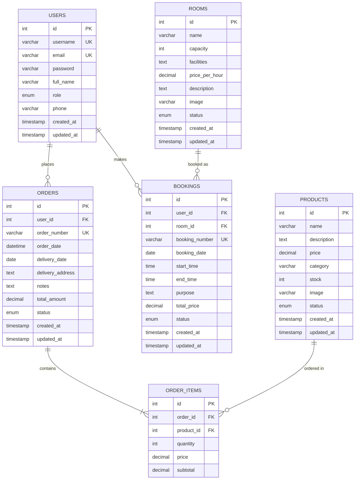

## 2. Use Case Diagram

```mermaid
graph TB
    subgraph "Room & Catering Management System"
        subgraph "Guest Actions"
            UC1[View Products]
            UC2[View Rooms]
            UC3[Register Account]
            UC4[Login]
        end
        
        subgraph "User Actions"
            UC5[Add to Cart]
            UC6[Place Order]
            UC7[Edit Order]
            UC8[Delete Order]
            UC9[View My Orders]
            UC10[Book Room]
            UC11[Edit Booking]
            UC12[Delete Booking]
            UC13[View My Bookings]
            UC14[Cancel Order/Booking]
        end
        
        subgraph "Admin Actions"
            UC15[Manage Products CRUD]
            UC16[Manage Rooms CRUD]
            UC17[Manage Orders]
            UC18[Update Order Status]
            UC19[Manage Bookings]
            UC20[Update Booking Status]
            UC21[View Reports]
            UC22[View Statistics]
            UC23[Manage Users]
        end
    end
    
    Guest((Guest))
    User((User))
    Admin((Admin))
    
    Guest --> UC1
    Guest --> UC2
    Guest --> UC3
    Guest --> UC4
    
    User --> UC5
    User --> UC6
    User --> UC7
    User --> UC8
    User --> UC9
    User --> UC10
    User --> UC11
    User --> UC12
    User --> UC13
    User --> UC14
    
    Admin --> UC15
    Admin --> UC16
    Admin --> UC17
    Admin --> UC18
    Admin --> UC19
    Admin --> UC20
    Admin --> UC21
    Admin --> UC22
    Admin --> UC23
```

## 3. Data Flow Diagram - Level 0 (Context Diagram)

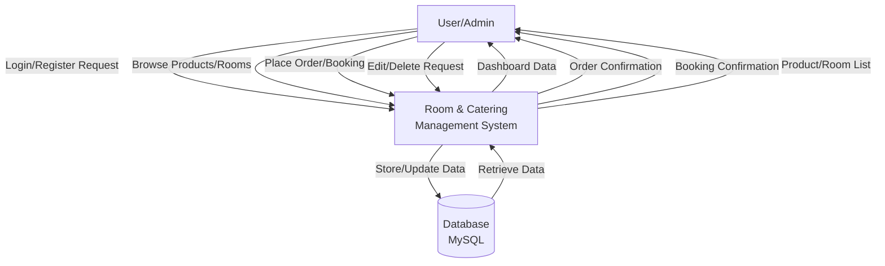

## 4. Data Flow Diagram - Level 1

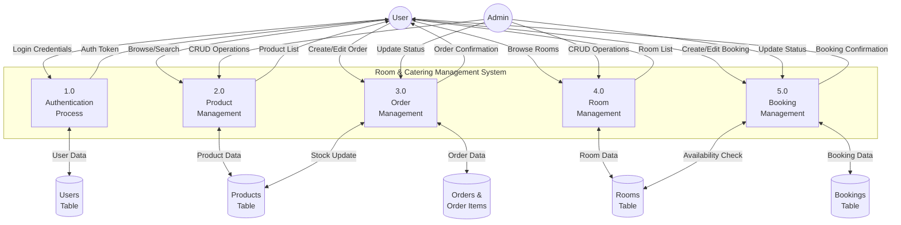

## 5. Class Diagram - Core Components

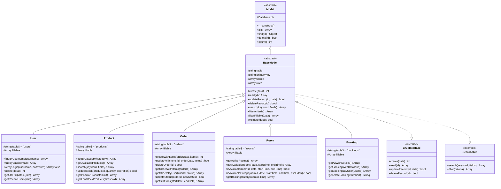

## 6. Class Diagram - Controllers

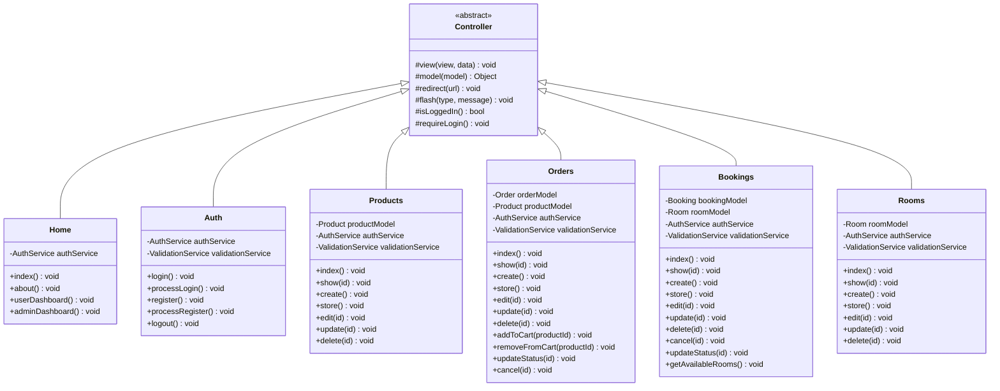

## 7. Sequence Diagram - Order Processing

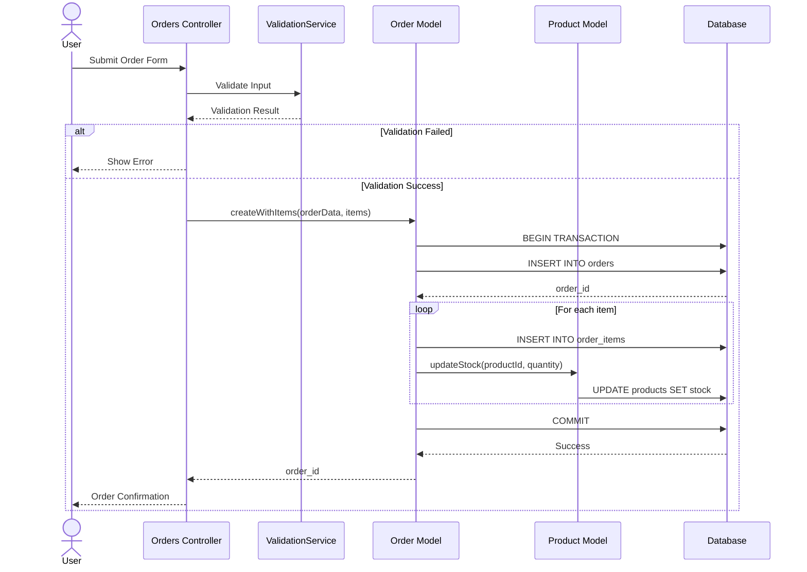

## 8. Sequence Diagram - Booking Edit Flow

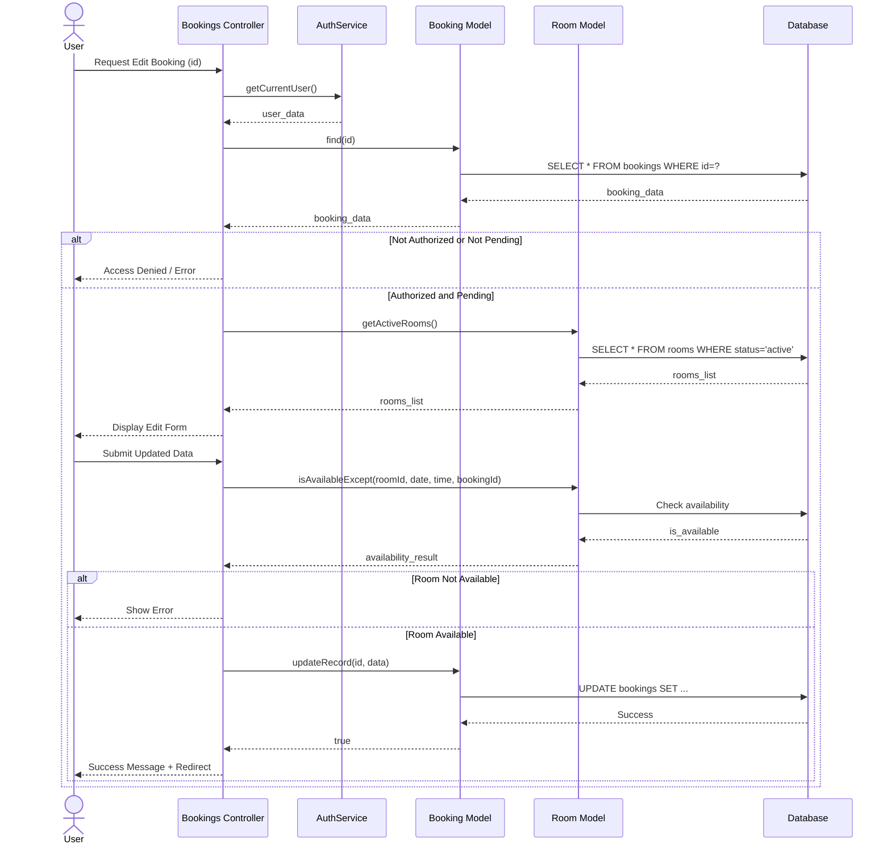

## 9. System Architecture Diagram

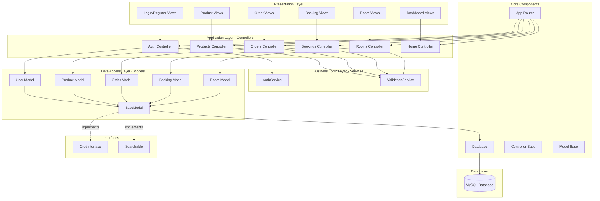

## 10. State Diagram - Order Status

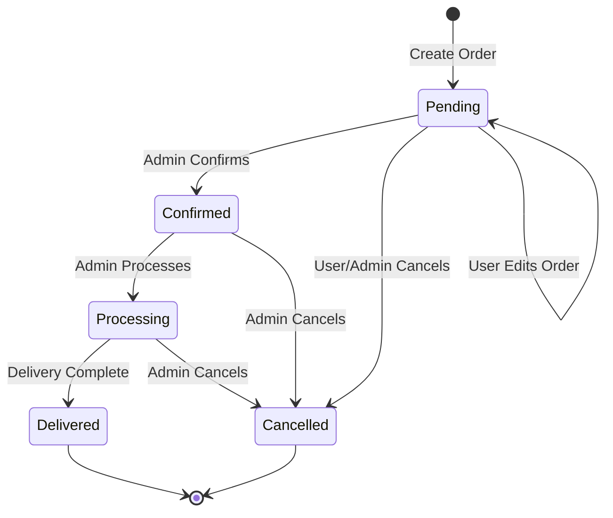

## 11. State Diagram - Booking Status

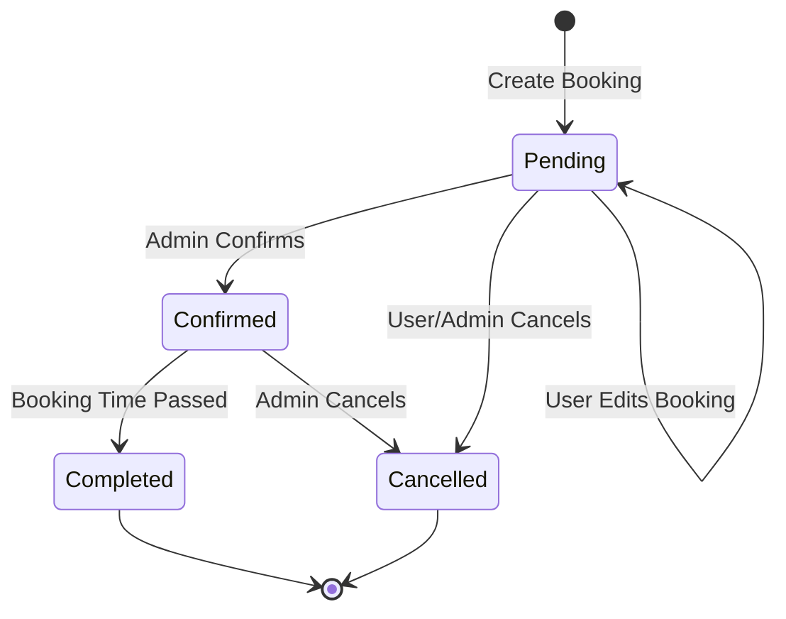

## 12. Component Diagram

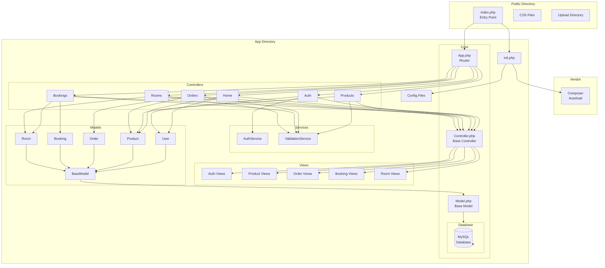

---

## Diagram Legends

### ERD Cardinality
- `||--o{` : One to Many
- `||--|{` : One to One or More
- `}o--||` : Many to One

### State Diagram
- `[*]` : Initial/Final State
- `-->` : State Transition

### Sequence Diagram
- `actor` : External User
- `participant` : System Component
- `->>` : Synchronous Call
- `-->>` : Return Message
- `alt/else/end` : Alternative Flow

### Class Diagram
- `+` : Public
- `-` : Private
- `#` : Protected
- `$` : Static
- `<<abstract>>` : Abstract Class
- `<<interface>>` : Interface
- `<|--` : Inheritance
- `..|>` : Implementation
